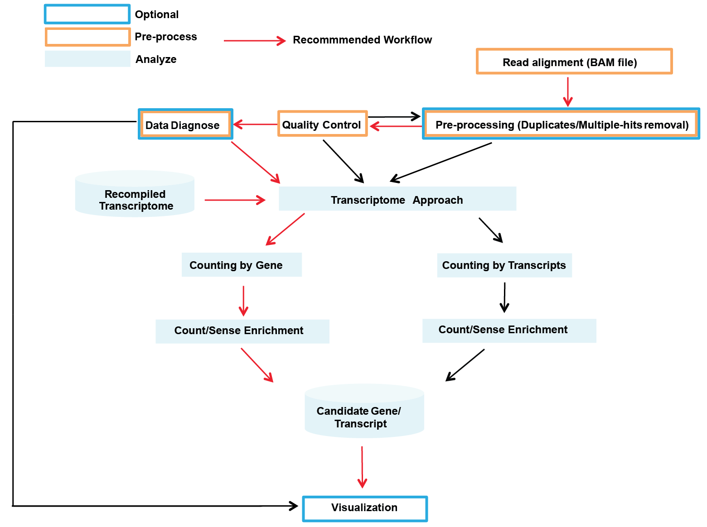
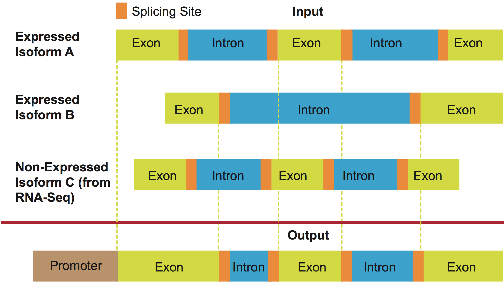
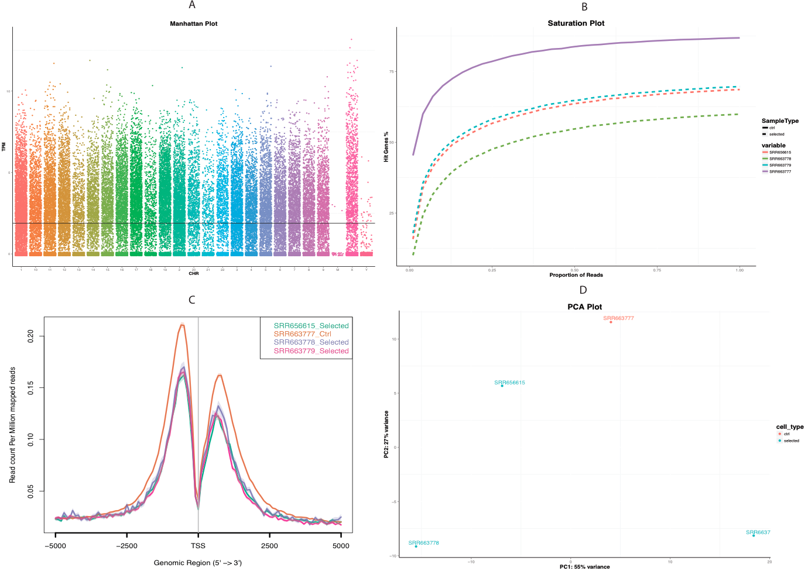
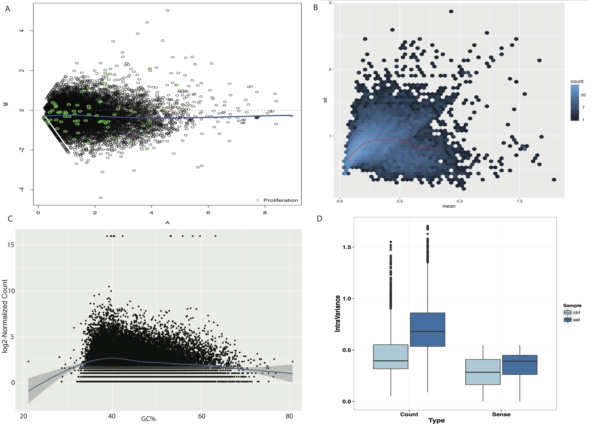
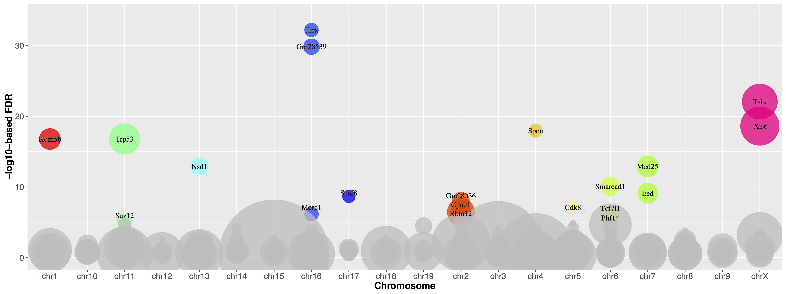
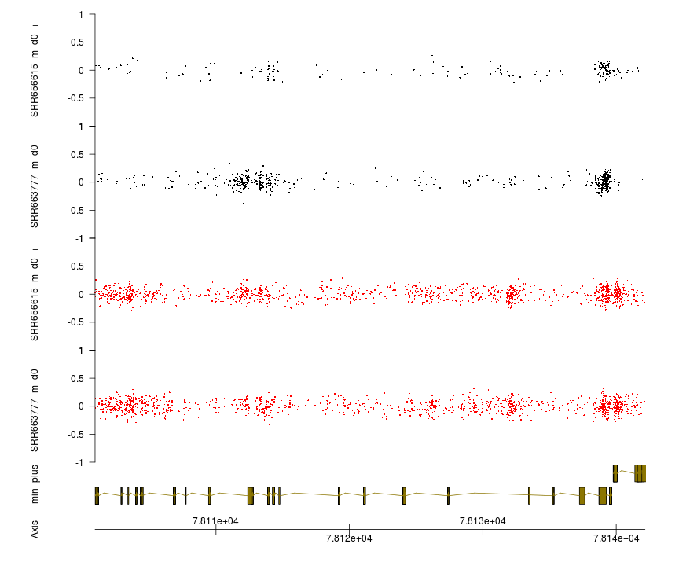

# VISITs
VISITs is a bioinformatic framework designed for handling haploid screening data, including pre-processing, quality check, analyzing, and visualization.

##Citation
`2017`
__Yu J__, Ciaudo C: Vector Integration Sites Identification for Gene-Trap Screening in Mammalian Haploid Cells. _Scientific reports_, [10.1038/srep44736](https://www.nature.com/articles/srep44736)

# Prerequisits and Installation
The VISITs pipeline runs on Linux. It requires following softwares:

[BEDTools suite (>=v2.18.0)](http://bedtools.readthedocs.org/en/latest/)

[SAMTools suite (>=v1.0.0)](http://www.htslib.org/)

[R Environment (>v3.0.0)](https://www.r-project.org/)

R packages (**Mandatory**):
```R
    source("http://bioconductor.org/biocLite.R")
    biocLite("edgeR")
    biocLite("DESeq2")
    biocLite("DSS")
    biocLite("BiocParallel")
    biocLite("biomaRt")
```
For quality check (Optional)
```R
   install.packages("doMC", dep=T)
   install.packages("caTools", dep=T)
   install.packages("ggplot2")
   biocLite("BSgenome")
   biocLite("Rsamtools")
   biocLite("ShortRead")
```
For Data Diagnose (Optional)
```R
   install.packages("devtools")
   library(devtools)
   install_github("kassambara/easyGgplot2")
```
For Recompiling Gene Model (Optional)
```R
   biocLite("GenomicFeatures")
   biocLite("IRanges")
```
For output visualization (Optional)
```R
   biocLite("GenomeGraphs")
   install.packages("knitrBootstrap")
   install.packages("rmarkdown")
   install.packages("ggrepel")
```

Download the source code of [VISITs](https://sourceforge.net/projects/visits/) to a folder, such as ~/software/VISITs, and extract it. 
```shell
   cd ~/software/VISITs
   unzip VISITs.zip
```   
Then, also download [annotation](https://sourceforge.net/projects/visits/files/annotation/) to the annotation folder where VISITs is, for example, [Human_GenecodeV23_Gene_Recompiled.tar.gz](http://downloads.sourceforge.net/project/visits/annotation/Human_GenecodeV23_Gene_Recompiled.tar.gz?r=https%3A%2F%2Fsourceforge.net%2Fprojects%2Fvisits%2Ffiles%2Fannotation%2F&ts=1468509264&use_mirror=pilotfiber):

```shell
   cd ~/software/VISITs/annotation
   tar -xzvf Human_GenecodeV23_Gene_Recompiled.tar.gz
```

For test dataset, please find [here](https://sourceforge.net/projects/visits/files/?source=navbar)
```shell
   cd ~/software/VISITs/
   unzip testdata.zip
```

Please make sure that you have the full read/write/execute permission in all these folders. 

# USAGE 
## Overview 
The pipeline of VISITs is shown as follows. All these modules could be run independently except visualization, which is based on the output from others.

 

Two approaches were implemented in VISITs to identify candidates: counting by gene or transcript . The first method is recommended, as it allows the detection of elements inserted into genes (intron or exon) and takes the direction of the insertion (sense or antisense) into account to improve performance. Counting by transcript will lead to more candidates, but the validition would be more challenging. 

## A Quick Start
```shell
cd ~/software/VISITs
mkdir -p testdata/output
> PATH_TO_VISITs/QC -f testdata/test1/exp_info.txt -g hg38 -o testdata/output -a annotation/Human_GenecodeV23_Gene_Recompiled
> PATH_TO_VISITs/VISITs_gene -m analyze -f testdata/test1/exp_info.txt -a annotation/Human_GenecodeV23_Gene_Recompiled -o testdata/output 
> PATH_TO_VISITs/VISITs_gene -m report -n 20 -o testdata/output -t 5 
```  

## Detailed Usage
### Mapping
The input of VISITs is the aligned file (BAM) from any aligner. A typical run could be like this: 

```shell
> bowtie -v 0 --sam -m 1 PATH_TO_BOWTIE_INDEX selected.fq | samtools view -bS - > selected.bam 
```  

Here, the genome sequence from [UCSC](http://hgdownload.cse.ucsc.edu/downloads.html) (hg38/mm10) are recommended. Ensembl genome files are available but not recommended, as some of the chromosome names are not compatible. For detailed usage of bowtie, please see [http://bowtie-bio.sourceforge.net/index.shtml](http://bowtie-bio.sourceforge.net/index.shtml).

### Recompiling Gene Model (Optional)
Gene model for human and mouse are availble [here](https://sourceforge.net/projects/visits/files/annotation/). If the user prefer customized gene model, please follow the instructions below. Otherwise this section can be skipped.

VISITs uses recompiled gene model from [Gencode](http://www.gencodegenes.org/) for human and mouse haploid cells. If RNA-seq data is available, non-expressed transcript could be filtered out to improve specificity of following statistical test (only [human](https://sourceforge.net/projects/visits/files/annotation/Human_GenecodeV23_Gene_Kallisto.tar.gz/download) are available). User could also recompile the gene model if it is not provided by VISITs. R scripts are included in the annotation folder. There are two different usages:

1. Automatically download and recompile gene model from UCSC (only applicable for gene model from RefSeq/Ensembl)
```
Rscript ./MakeAnno_SS.R genome_version database number_threads
genome_version: hg18/19, mm9/10
database: refGene, ensGene
```

2. Provide a customized GFF file from user. This gff file could be retrieved from [Gencode](http://www.gencodegenes.org/). In this case, the process to generate the recompiled model is the same as the method above; In another hand, this gff file could also be generated by any transcriptome reconstruction pipeline (e.g., [Cufflink](http://cole-trapnell-lab.github.io/cufflinks/) ) or quantification software (e.g., [Kallisto](https://pachterlab.github.io/kallisto/about) ), in which only expressed transcripts are recorded. 
```
Rscript MakeAnno_SS_gff.R input.gff output_folder number_threads
```

Basically, the scripts genereates a gene model where all annotated exons for one gene are connected into one artificial transcript, thus any insertion in a potential ‘exon’ region would be counted. Canonical splicing sites (GU and AG) are included (as follows). Promoter regions could also be specified by the user (see *Run Analyze*).

 


### Preprocessing (Optional)
To avoid overestimation of insertion sites, duplicated and multiple-hit reads should be removed during alignment. If these reads have been already removed, this section can be skipped.

```shell
> PATH_TO_VISITs/preProcess -d0 -m -i input.bam -o output.bam
``` 

More detailed usage:
```
Usage : ./preProcess [options] [-i input.bam] [-o output.bam] [-t number of Threads]
Options
-m remove multiple-hit reads
-d [int] remove duplicates with in [int] bp
-y [default:Y] remove reads in Y-choromosome
-t [default:1]number of Threads to use in samtools
-h <help>
```

### Quality Check
VISITs provides quality check on three levels. Gene-level quality check helps to identify if the insertions in each chromosome is biased by manhattan plot (A) or, if the sequencing depth is sufficient by saturation plot(B); Reads-level quality check helps to identify if the insertion prefers certain region for each gene (C), as this is always the case for retrovirus; Sample-level quality check helps to identify if the samples were separated after selection (D). To run QC, a txt file including the input file name and information will be **necessary**. A typical single Control v.s. Selected experiment design would be the file included in `testdata/test1/exp_info.txt`. Please note the column name is **fixed**. '#' means this line is masked and 'SampleType' should **always** be 'Selected' or 'Ctrl'

```shell
# Tab-delimited File
# 1st Column: Path and Filename
# 2nd Column: always -1
# 3rd Column: sample name which  will be shown in the figures legend
# 4rd Column: sample type which will be shown in different color in the figures
# 5th Column: covariates (optional)
FileName        Tag     SampleName      SampleType
testdata/test1/SRR656615_m_d0.bam       -1      SRR656615       Selected
testdata/test1/SRR663777_m_d0.bam       -1      SRR663777       Ctrl
```

If the experiment includes replicates and other covariates, which should be accounted for, the experiment design file should be similar with `testdata/test2/exp_info.txt`. The covariates should be attached in the last column, with **user-specified** column name.

```shell
FileName        Tag     SampleName      SampleType      Passage
testdata/test2/ELAM4D5.bam      -1      ELAM4D5 Selected        4
testdata/test2/ELAM5D5.bam      -1      ELAM5D5 Selected        5
testdata/test2/ELAM8D5.bam      -1      ELAM8D5 Selected        8
testdata/test2/ELAM9D5.bam      -1      ELAM9D5 Selected        9
testdata/test2/ELAM10D5.bam     -1      ELAM10D5        Selected        10
testdata/test2/ELAM4C.bam       -1      ELAM4C  Ctrl    4
testdata/test2/ELAM5C.bam       -1      ELAM5C  Ctrl    5
testdata/test2/ELAM8C.bam       -1      ELAM8C  Ctrl    8
testdata/test2/ELAM9C.bam       -1      ELAM9C  Ctrl    9
testdata/test2/ELAM10C.bam      -1      ELAM10C Ctrl    10
```
Results for each level are provided in the output folder as pdf/png files. An RData file `qc.RData` is also generated.

```shell
> bash PATH_TO_VISITs/QC -f testdata/test1/exp_info.txt -g hg38 -o testdata/output -a annotation/Human_GenecodeV23_Gene_Recompiled
``` 
 

More detailed usage:
```
Usage : /PATH/TO/QC [-g hg38 or mm10] [-e 5 or 3] [-f ExperimentInfo file] [-a Annotation directory] [-i 2.5] [-o Output directory] [-h display this Help] [-v Display running info]
Options
-g Species Name, hg38 or mm10
-e [Default: 5] Count 5' end or 3' end insertion sites (Optional)
-f Experiment Information File including BAM filename, sample name and sample type
-a Annotation folder where recompiled GENE MODEL is
-i [Default: 2.5] Including iKb upstream when performing QC (Optional)
-o Output folder; If sucessfully runned, three pdf file will be generated
-v Display Detailed Running information
```

### Data Diagnose (Optional)
VISITs also provides data diagnose, including M-A plot(A), mean-dispersion plot(B), GC-content bias(C) and intra-group variance(D).

```shell
>./VISITs_gene -s TC -m diagnose -f testdata/test1/exp_info.txt -a annotation/Human_GenecodeV23_Gene_Recompiled -o testdata/output
``` 
 

More detailed usage:
```
Usage : ./VISITs_gene [-m diagnose] [-r minimum number of reads for each candidate] [-e specifiy 3/5 End insertion] [-f input filename] [-a Annotation directory] [-i Inclusion Kb upstream] [-s normalization methods] [-o Output directory] [-v display RUNTIME info] [-h display this Help]
Options
-m diagnose
-r [Default: 1] minimum number of reads for each candidate. Candidates with fewer reads are discarded before entering test
-e [Default: 5] Count 5' end or 3' end insertion sites
-f a text file with input file path and experiment design
-a Annotation file folder containing the three annotation file: GeneIntervalModel.bed, IntronGeneModel.bed and syntheticGeneModel.bed
-i [Default: 0] Reads inserted into iKb upstream (promotor) of the gene will also be included
-s [Default: DESeq] Normalization methods, other options: TC(Total Count), TMM (edgeR), DESeq (RLE), upper (Upper Quartile) and ctrl (using ctrl genes) 
-o Output folder for all mode
-v printing Detailed running information 
-h <help> 
``` 

### Run Analyze
Two approaches were implemented in VISITs to identify candidates: counting by gene and/or transcript. 

More detailed usage:
```
Usage : ./VISITs_gene [-m running mode] [-r minimum number of reads for each candidate] [-e specifiy 3/5 End insertion] [-f input filename] [-a Annotation directory] [-i Inclusion Kb upstream] [-s normalization methods] [-t number of Threads] [-o Output directory] [-n number of Genes] [-v display RUNTIME info] [-h display this Help]
Options
-y [Default: pos] Screening type. Can be pos (positive screening) or neg (negative screening) (analyze mode)
-m [Default: analyze] VISITs Running mode. analyze: identify candidates; diagnose: generate diagnose plots; report: generate output html
-r [Default: 1] minimum number of reads for each candidate. Candidates with fewer reads are discarded before entering test
-e [Default: 5] Count 5' end or 3' end insertion sites 
-f a text file with input file path and experiment design 
-i [Default: 0] Reads inserted into iKb upstream (promotor) of the gene will also be included 
-s [Default: DESeq] Normalization methods, other options: TC(Total Count), TMM (edgeR), DESeq (RLE), upper (Upper Quartile) and ctrl (using ctrl genes) 
-t [Default: 1] Number of Threads to be used 
-a Annotation file folder containing the three annotation file: GeneIntervalModel.bed, IntronGeneModel.bed and syntheticGeneModel.bed 
-o Output folder for all mode; for report mode, also as input folder 
-v printing Detailed running information 
-h <help> 
``` 

Using the same output folder as QC, e.g., `testdata/output` could improve running speed, as some of the files have already been generated in QC. 

From our experience, **counting-by-gene** method is preferred in most scenarios. In this case various statistical tests were implmmeneted, accounting for both single comparison and complicated experiment design.

1. single comparison
 + Count Enrichment: Fisher-exact Test => **fdr_count** and **fc** (i.e., odds ratio, enriched in sel. library: > 1 , otherwise, < 1) in results
 + Sense Enrichment: Binomial Test => **fdr_sense** and **enrich** (i.e., enriched in sel. library:1, otherwise, -1) in results
2. Complicated experiment design
 + Count Enrichment: Negative-binomial model (Wald Test + dispersion from LocalFit) => **fdr_count** and **Log2FC** (sel. vs ctrl.) in results. By default outlier detection is only turned on when there is more than 7 replicates.
 + Sense Enrichment: Beta-binomial model (DSS) => **fdr_sense** and **DSS_stat** (sel. vs Ctrl.) in results

For each situation, VISITs will generate a corrected P-value (BH method) and a statistics indicating if the gene is significant in postive/negative selection (**fc/enriched/Log2FC/DSS_stat**) in `results_gene.txt`. A combined p value was generated based on these two p-values, using number of insertion sites as weights (**sumz_p** & **sumz_fdr**). An RData file is also generated: `gene.RData`.

A sliding window approach was also added into VISITs to identify intergenetic elements: `VISITs_sliWin`. For now it only supports single replicate and output FDR and nearby annotated genes for each gene. In practice, we do not recommend users to use the sliding window approach for following reasons:

1. The sensitivity would be compromised for annotated genes. This is because the mutational insertion tends to be located in exonic region and sense strand, but these information are lost in sliding-window approach. 
2. The insertion preference of vectors is around transcription starting site of activated genes. Therefore it is difficult to identify intergenetic events due to lower coverage.
3. Biologically, an insertion in a gene would probably cause a truncated protein, or erroneous folding of a noncoding RNA, but an insertion in the intergentic region would only disrupt transcription. Therefore, the interested phenotype is less likely to be caused by insertions in the intergenetic elements.  

### Visualization (Optional)
After successfully performing all the analysis above, using report mode to summary all the results and generate an HTML document.
```shell
> PATH_TO_VISITs/VISITs_gene -m report -n 20 -o testdata/output -t 5 ##Display Top 20 genes using 5 Threads
``` 
The HTML document `report.html` is composed of three parts: quality check (if in the same folder), analyze results and R session information. Besides the outputs already mentioned, report module will generate two additional figures:

* bubble plot
 

* Insertion Track
 

More detailed usage:
```
Usage : ./VISITs_gene -m report [-t number of Threads] [-o Output directory] [-n number of Genes]  [-h display this Help]
Options
-t [Default: 1] Number of Threads to be used 
-o Output folder for analyze mode; for report mode, also as input folder 
-n [Default: 10] Number of Genes to be reported
-h <help>
``` 


